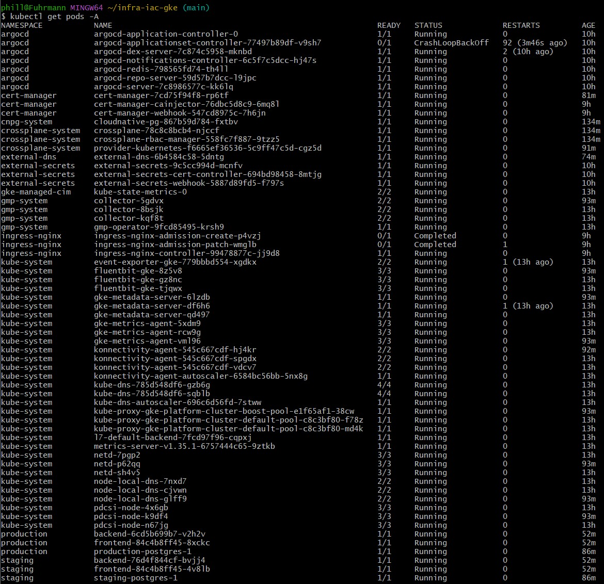

# 📘 infra-iac-gke

Dieses Repository enthält die Infrastructure-as-Code (IaC) Konfiguration für die Plattform.  
Die Infrastruktur wird vollständig mit **Terraform** in Google Cloud bereitgestellt und bildet die Grundlage für das GitOps‑Repository (*platform-gitops*).

---

## Zweck dieses Repositories

Dieses Repository wird von **Person 1** gepflegt und stellt die komplette Basisinfrastruktur bereit, die später von ArgoCD und dem GitOps‑Workflow genutzt wird.

Es provisioniert:

- einen **GKE‑Cluster**
- die notwendigen **IAM‑Rollen**
- eine **Service Account‑Identität** für Workload Identity
- eine **statische LoadBalancer‑IP**
- einen **DNS A‑Record** für die Plattform‑Domain
- ein **Managed Certificate** für HTTPS

Damit wird die gesamte Infrastruktur automatisiert, reproduzierbar und versioniert bereitgestellt.

---

## Terraform ausführen

Um die Infrastruktur zu erstellen, werden folgende Schritte ausgeführt:

```bash
terraform init
terraform plan
terraform apply
```

---

## Screenshots / Nachweis


*Die von dieser IaC bereitgestellte Plattform – Produktions-Tenant live unter https://production.gcloud.it-n.at*



*Laufende Pods im provisionierten Cluster (kubectl get pods -A)*
